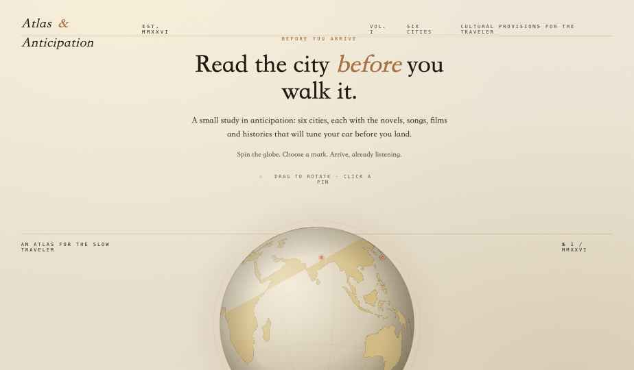

# Atlas of Anticipation

> *A small globe that remembers what places mean to the people who love them.*
> 一颗记录"一座城对爱它的人意味着什么"的小地球。

[**Live demo →**](#) *(replace this link with your GitHub Pages URL after deploying)*



---

## English

**Atlas of Anticipation** is an interactive globe of cities — not their landmarks or tourist routes, but the *novels written in them, the films set on their streets, the music born in their cafés, and the histories that shaped their light.* Spin the globe, pick a city, and read what makes that place feel like itself.

It's open-source and community-built. **If a city you love is missing, or a city that's here is missing something you know — please open a PR.** A paragraph, a film, a piece of music, a memory. The atlas grows by accretion.

### Run it locally

No build step. Just serve the folder.

```bash
# any static server works — for example:
python3 -m http.server 8000
# then open http://localhost:8000/index.html
```

Or just double-click `index.html` (some browsers block `fetch()` from `file://`; if the land map doesn't load, use the local server above).

### Tech

- Vanilla HTML + React 18 via Babel-standalone (no bundler)
- `d3-geo` for the orthographic projection
- TopoJSON coastlines from [Natural Earth](https://www.naturalearthdata.com/) via [world-atlas](https://github.com/topojson/world-atlas)
- Trilingual UI (English / 简体中文 / 繁體中文) with per-city localized fields

### Contribute

See [`CONTRIBUTING.md`](CONTRIBUTING.md) for how to add a city, fix a typo, suggest a film, or improve the design. Every entry should feel hand-written, not scraped.

### License

[MIT](LICENSE) — fork freely. Attribution appreciated but not required.

---

## 中文 (简体)

**Atlas of Anticipation**（"期盼之图集"）是一颗交互式地球仪，记录的不是城市的地标和旅游路线，而是 **写于这座城的小说、发生在它街上的电影、诞生在它咖啡馆的音乐、塑造了它光线的历史**。转动地球、选一座城，去读那些让它成为它自己的东西。

这是一个开源、社区共建的项目。**如果你爱的某座城不在这里，或者已有的某座城少了你知道的东西——请提一个 Pull Request。** 一段话、一部电影、一首音乐、一段回忆都好。这本图集靠堆积生长。

### 本地运行

不需要 build，挂一个静态服务器就行：

```bash
python3 -m http.server 8000
# 浏览器打开 http://localhost:8000/index.html
```

也可以直接双击 `index.html` 打开（部分浏览器会因为 CORS 拒绝从 `file://` 加载海岸线数据；如果地球是空的，用上面的本地服务器）。

### 技术栈

- 原生 HTML + React 18（通过 Babel-standalone 即时编译，无打包步骤）
- `d3-geo` 做正射投影
- 海岸线数据来自 [Natural Earth](https://www.naturalearthdata.com/)（经 [world-atlas](https://github.com/topojson/world-atlas) 转 TopoJSON）
- 三语界面（英文 / 简体 / 繁體），每座城的字段也分语言

### 如何贡献

完整指南在 [`CONTRIBUTING.md`](CONTRIBUTING.md)。加一座城、补一部电影、改一个错别字、调一处排版——都欢迎。希望每条记录读起来像手写的，不是抄来的。

### 协议

[MIT](LICENSE)。随便 fork，注明出处感激但不强求。

---

*Made with care. Spin slow.*
